*Read this in other languages: [英語](README.md),[中国語](README-cn.md).*

# Build Blockchain Insurance Application

このプロジェクトは、クレーム処理のための保険ドメインにおけるブロックチェーンの使用を紹介しています。 このアプリケーションでは、保険、警察、修理工場、ショップの4者が参加します。 保険会社Peerは、保険会社が製品の保険を提供しており、保険金請求の処理を担当しています。 警察Peerは盗難の主張を検証する責任があります。 修理工場Peerは製品の修理を担当し、ショップPeerは製品を消費者に販売します。

開発者のレベル : 中級

## 含まれるコンポーネント
* Hyperledger Fabric
* Docker

## アプリ概要図
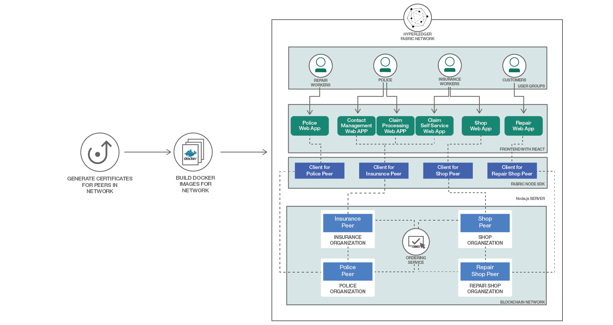

* Peer用証明書の生成
* Dockerイメージのビルド
* 保険ネットワークの開始

## 前提条件
Nodeをインストールする際に、Blockchainでやや問題があります。 こちらをシェアします。 [StackOverflow response](https://stackoverflow.com/questions/49744276/error-cannot-find-module-api-hyperledger-composer) - Composerで表示されるエラーは、間違ったノードバージョンをインストールした場合や、Composerでサポートされていない方法を使用した場合に派生したものです。: 

* [Docker](https://www.docker.com/products/overview) - v1.13 or higher
* [Docker Compose](https://docs.docker.com/compose/overview/) - v1.8 or higher
* [NPM](https://www.npmjs.com/get-npm) - v5.6.0 or higher
* [nvm]() - v8.11.3 (use to download and set what node version you are using)
* [Node.js](https://nodejs.org/en/download/) - node v8.11.3 ** don't install in SUDO mode
* [Git client](https://git-scm.com/downloads) - v 2.9.x or higher
* [Python](https://www.python.org/downloads/) - 2.7.x

## ステップ

1. [Run the application](#1-run-the-application)

## 1. アプリケーションの実行

リポジトリをクローンします。
```bash
git clone https://github.com/IBM/build-blockchain-insurance-app.git
```

自分の [docker hub](https://hub.docker.com/) の資格情報を使用してログインします。
```bash
docker login
```

Build Scriptを実行して、保険会社Peer、警察Peer、ショップPeer、修理工場Peer、ウェブアプリケーション、および認証機関のDockerイメージをダウンロードして作成します。 これには数分間かかる場合があります。

For Mac user:
```bash
cd build-blockchain-insurance-app
./build_mac.sh
```

For Ubuntu user:
```bash
cd build-blockchain-insurance-app
./build_ubuntu.sh
```

You should see the following output on console:
```
Creating repairshop-ca ...
Creating insurance-ca ...
Creating shop-ca ...
Creating police-ca ...
Creating orderer0 ...
Creating repairshop-ca
Creating insurance-ca
Creating police-ca
Creating shop-ca
Creating orderer0 ... done
Creating insurance-peer ...
Creating insurance-peer ... done
Creating shop-peer ...
Creating shop-peer ... done
Creating repairshop-peer ...
Creating repairshop-peer ... done
Creating web ...
Creating police-peer ...
Creating web
Creating police-peer ... done
```

**アプリケーションがネットワークにチェーンコードをインストールしてインスタンス化するまで数分間待ちます。**

次のコマンドを使用してインストール状況を確認できます。
```bash
docker logs web
```
完了すると、コンソールに次の出力が表示されます。
```
> blockchain-for-insurance@2.1.0 serve /app
> cross-env NODE_ENV=production&&node ./bin/server

/app/app/static/js
Server running on port: 3000
Default channel not found, attempting creation...
Successfully created a new default channel.
Joining peers to the default channel.
Chaincode is not installed, attempting installation...
Base container image present.
info: [packager/Golang.js]: packaging GOLANG from bcins
info: [packager/Golang.js]: packaging GOLANG from bcins
info: [packager/Golang.js]: packaging GOLANG from bcins
info: [packager/Golang.js]: packaging GOLANG from bcins
Successfully installed chaincode on the default channel.
Successfully instantiated chaincode on all peers.
```

http://localhost:3000 のリンクでブラウザでWebアプリケーションへアクセスします。

ホームページには、ネットワーク内の参加者（Peer）が表示されます。 保険、修理工場、警察、ショップPeerが導入されていることがわかります。彼らはネットワークの参加者です。

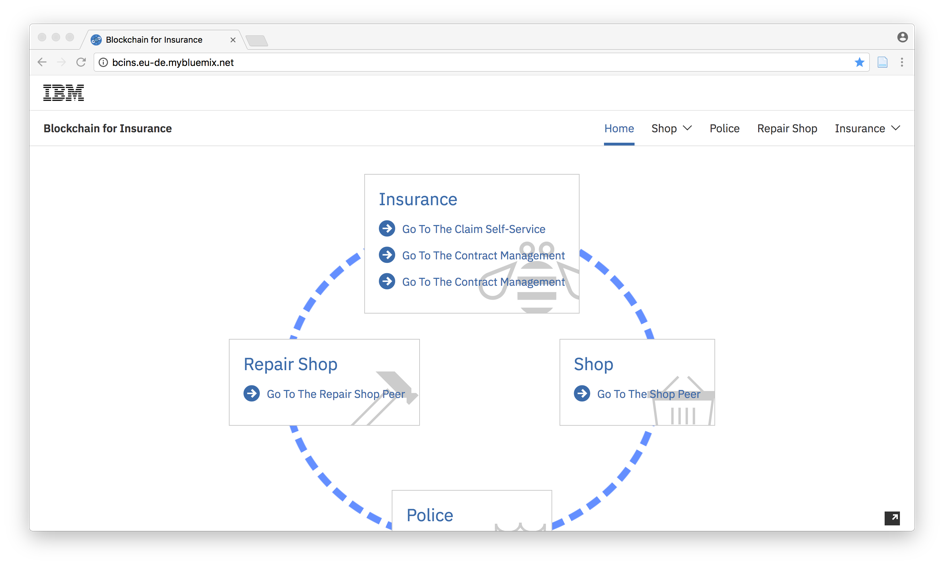

電話、自転車、またはスキーを購入したい消費者（以下、「バイカー」と呼ぶ）を想像してみてください。 「ショップに行く」セクションをクリックすると、以下の製品を提供するショップ（ショップPeer）にリダイレクトされます。

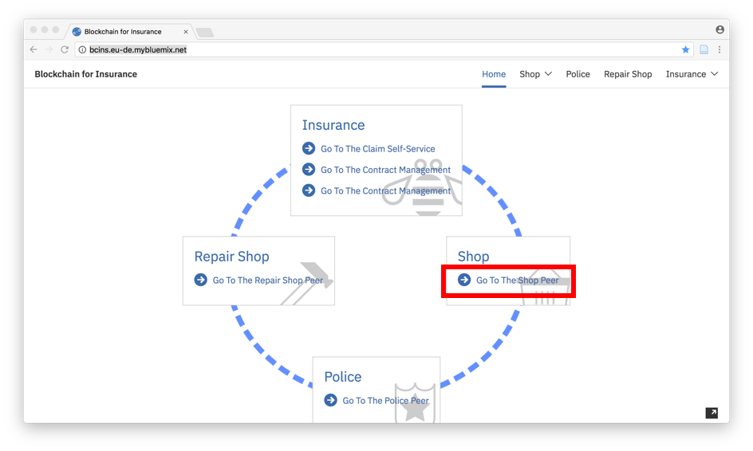

あなたは今店で提供されている3つの製品を見ることができます。 さらに、あなたには保険契約があります。 私たちのシナリオでは、新しいバイク（自転車）を購入したいアウトドアスポーツ愛好家です。 ということで、Bike Shopセクションをクリックします。

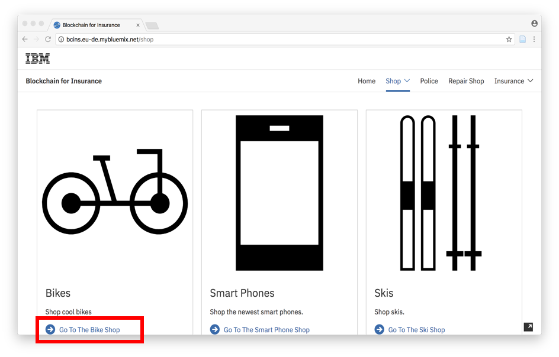

このセクションでは、店舗で利用可能なさまざまな自転車を見ています。 4種類の自転車内で選択できます。 次へをクリックすると、次のページに転送され、顧客の個人データが要求されます。

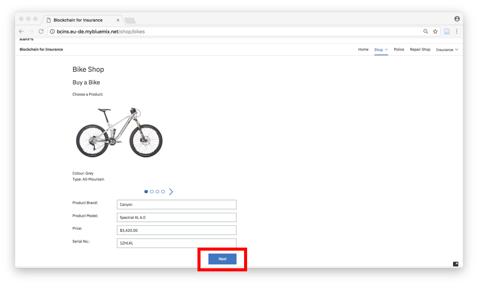

さまざまな保険契約と契約条件の異なる保険契約の中から選択することができます。 個人データを入力し、契約の開始日と終了日を選択する必要があります。 保険業界では、短期またはイベント主導の契約の傾向があるため、契約の期間を日単位で選択する機会があります。 保険契約の1日の価格は、チェーンコードで定義された数式によって計算されています。 次へをクリックすると、購入を要約した画面に転送され、総額が表示されます。

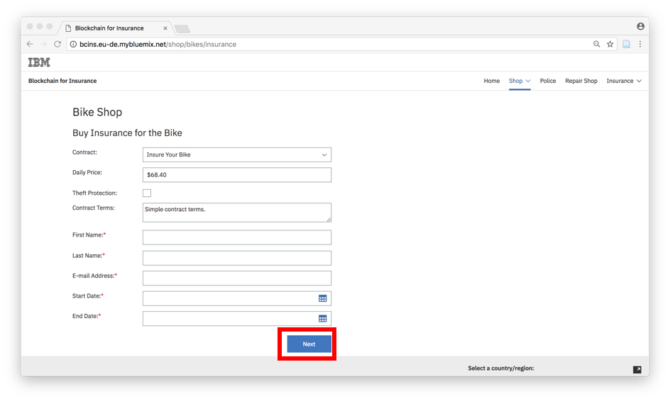

アプリケーションはあなたの購入の総額を表示します。 「注文」をクリックすると、利用規約に同意し、契約を締結します（契約の署名）。 さらに、一意のユーザー名とパスワードを受け取ります。 クレームを提出すると、ログイン資格情報が使用されます。 そしてブロックがブロックチェーンに書き込まれます。

>note 右下の黒い矢印をクリックすると、ブロックを確認することができます。

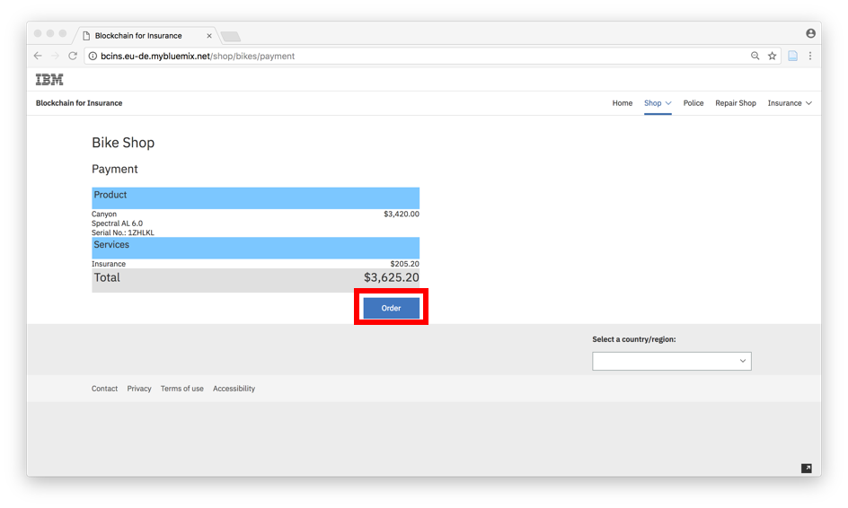

ログイン資格情報。チェーンに書き込まれたブロックです。

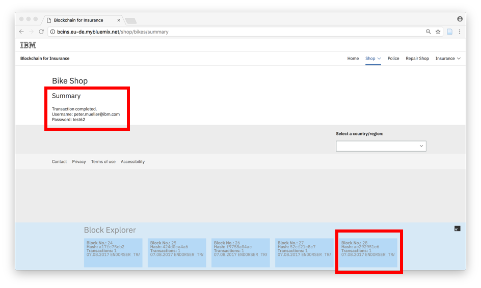

インシデントが発生すると、バイカーは「自己申告のセルフサービス」タブを選択して自分の申し立てを提出することができます。

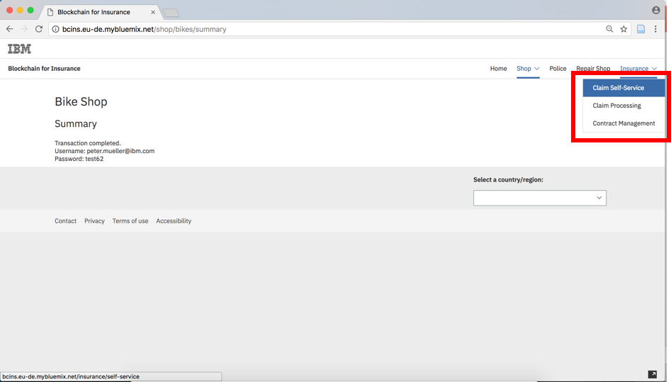

バイカーは以前与えられた資格情報を使用してログインするように求められます。


上記のタブを選択することによって新しい請求を提出することができます。

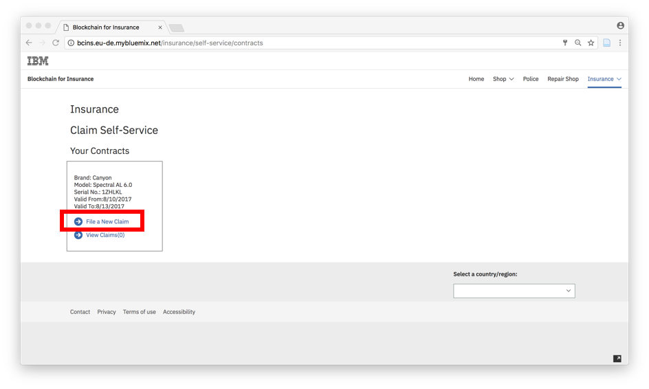

バイカーは自転車の損傷を簡単に説明したり、盗難の有無を選択することができます。 自転車が盗難された場合、請求は、盗難を確認または拒否しなければならない警察を通じて処理されます（オプション1）。 ただ損傷があった場合、請求は修理工場で処理されます（オプション2）。 次のセクションでは、オプション1から開始します。

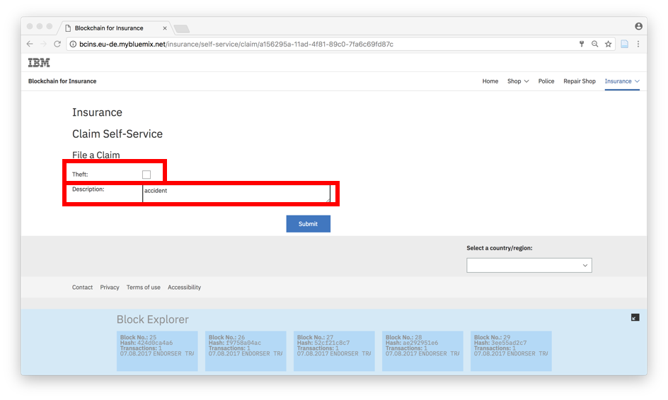

**オプション1**

バイカーがクレームを提出すると、それは赤色のボックスに表示されます。 さらに、別のブロックがチェーンに書き込まれます。
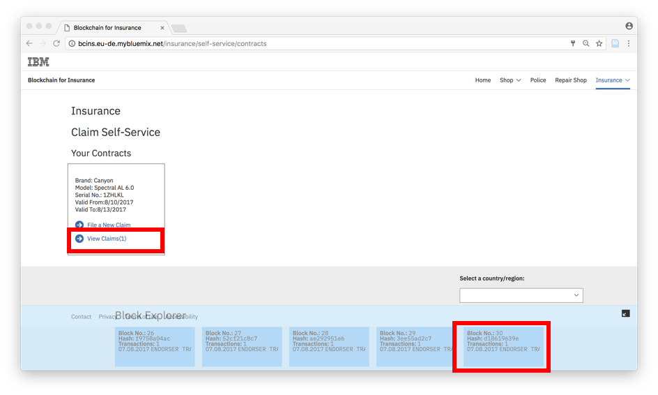

バイカーは、アクティブなClaimを見ることもできます。 **Note:** 新しいアクティブなClaimを表示するには、クレーム処理に再ログインする必要があります。

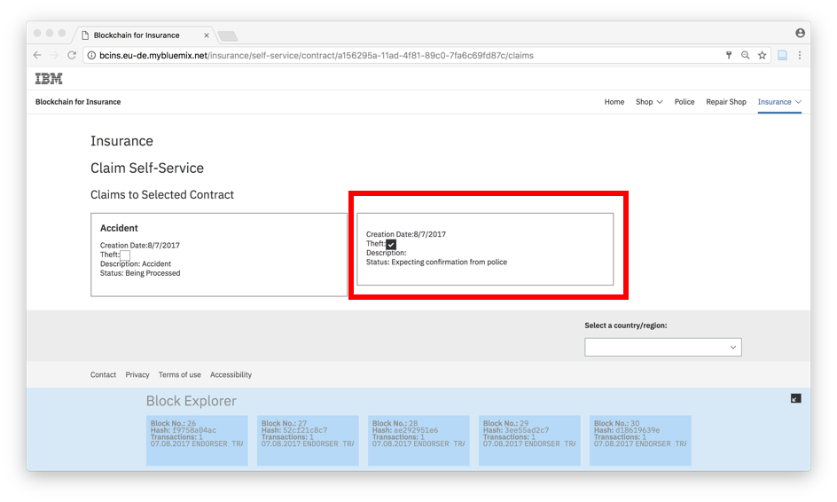

「請求処理」を選択することにより、保険会社はまだ処理されていないすべての有効な請求を閲覧することができます。 書記官はこの見解で主張を決定することができます。 私たちはまだオプション1を見ているので、盗難は警察によって確認または却下されなければならない。 したがって、保険会社は段階的にこの時点で請求を却下することができます。

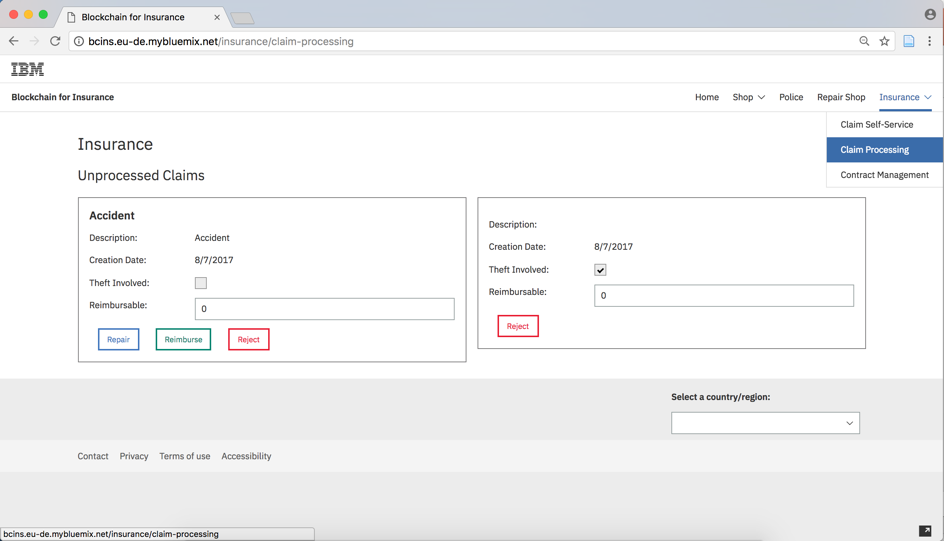

警察は、盗難を含む請求を閲覧することができます。 自転車の盗難が報告されている場合は、主張を確認してファイル参照番号を記載することができます。 盗難が報告されていない場合、訴訟は却下され、処理されません。

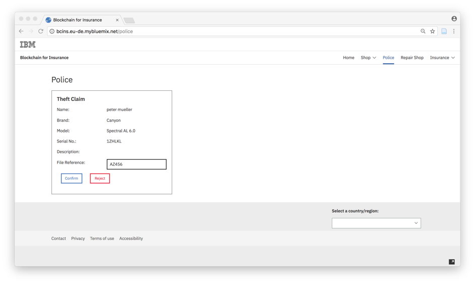

バイカーが保険会社を盗まれておらず、バイクを盗難として報告したとしましょう。 警察は、別のブロックがチェーンに書き込まれるという請求を確認します。

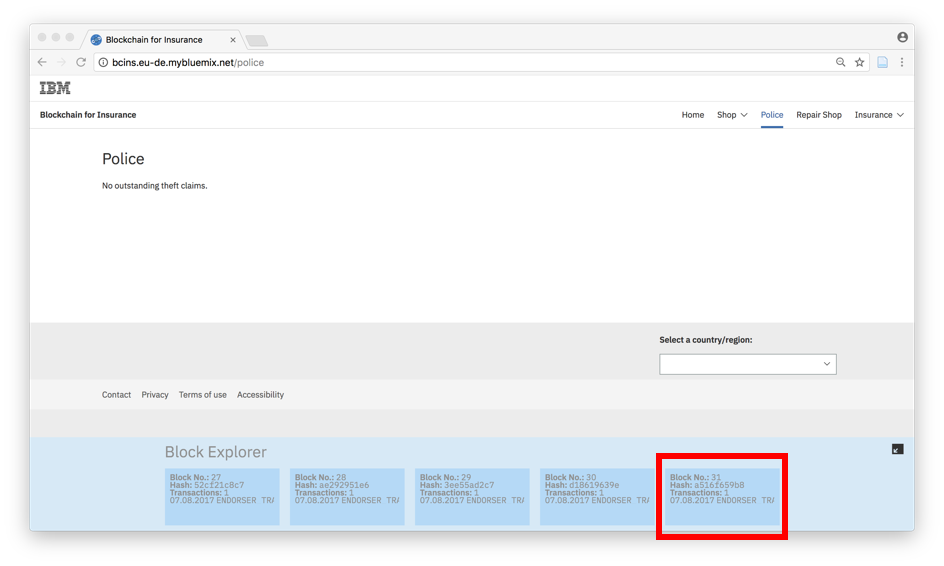

「クレーム処理」タブに戻ると、警察が自転車が盗難されたことを確認したため、保険会社に請求を払い戻すオプションがあることがわかります。 ブロックがチェーンに書き込まれます。

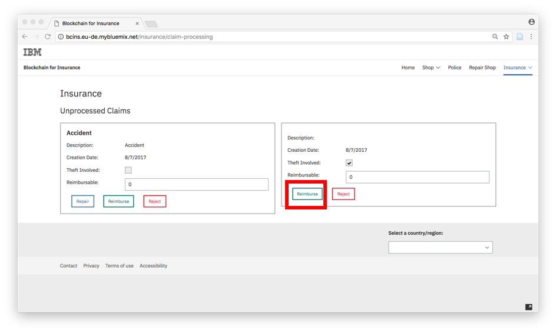

バイカーは、払い戻しに変更された彼の請求の新しいステータスを見ることができます。

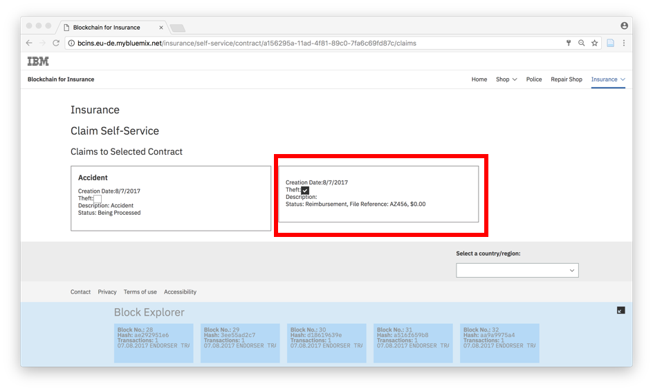

**オプション2**

オプション2は、事故のケースをカバーしています。

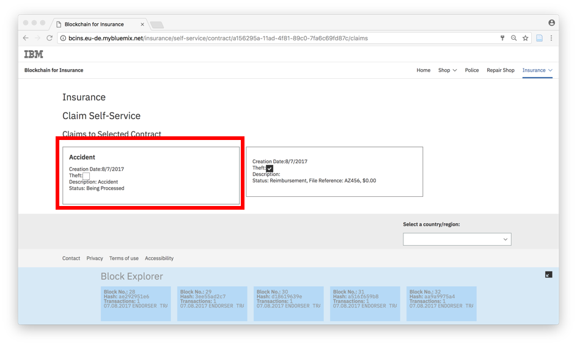

保険の「請求処理」タブに未処理の請求が表示されます。 書記官は、請求を処理する方法について3つの選択肢から選択することができます。 「払い戻し」はクレーム処理を停止し、「払い戻し」は顧客への支払いに直接つながります。 何かを修理する必要がある場合、保険会社は「修理」を選択するオプションを持っています。 これは請求を修理工場に転送し、修理命令を生成します。 ブロックがチェーンに書き込まれます。

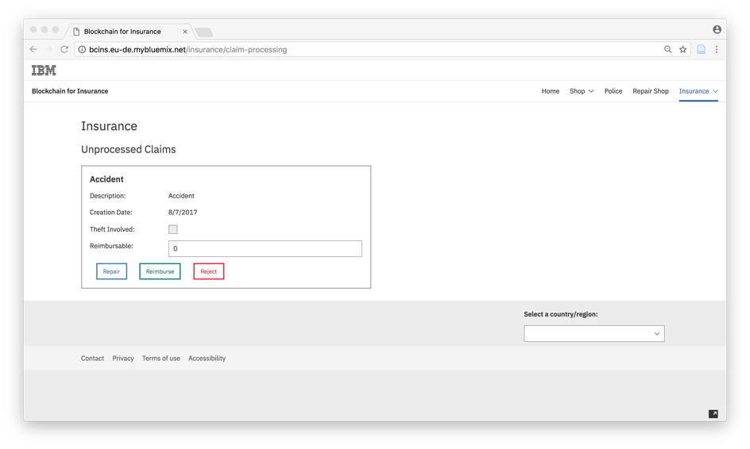

修理工場に修理指示を示すメッセージが表示されます。 彼らが修理作業を完了すると、修理工場は完了した注文をマークすることができます。 その後、保険会社は修理工場への支払いを進めるメッセージを受け取る。 ブロックがチェーンに書き込まれます。

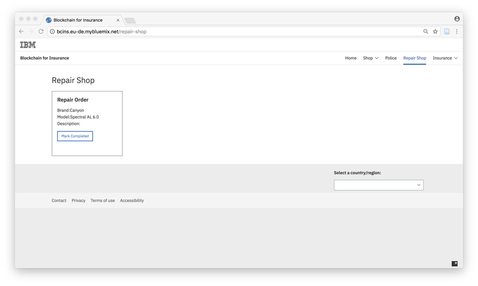

バイカーは、彼の「請求セルフサービス」タブで、請求が解決され、自転車が店で修理されたことを見ることができます。

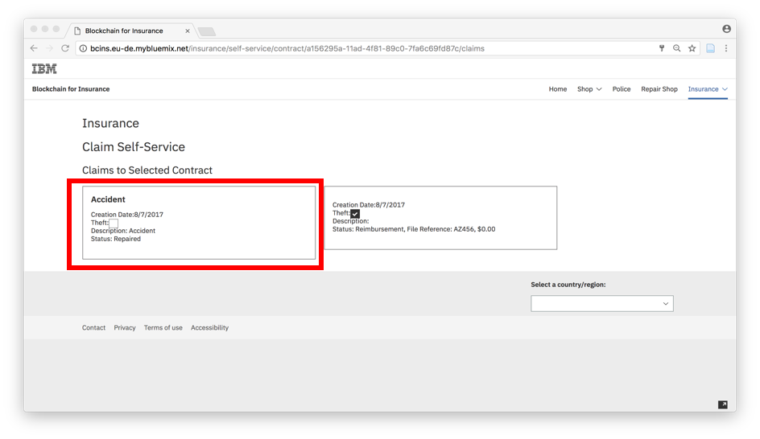

保険会社には、特定の契約を有効または無効にするオプションがあります。 これは、すでに顧客が署名した契約がもはや有効ではないことを意味するものではありません。 これらのタイプの契約では新しい署名を許可しません。 さらに、保険会社は、異なる契約条件と異なる価格を持つ新しい契約テンプレートを作成する可能性があります。 どのトランザクションでもブロックがチェーンに書き込まれます。

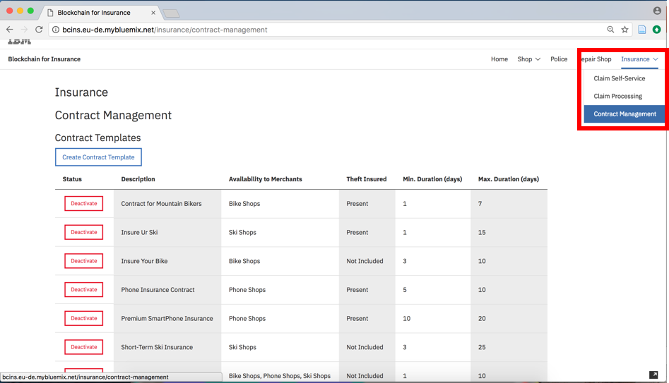

## 追加リソース
以下は、追加のブロックチェーンリソースのリストです。
* [Fundamentals of IBM Blockchain](https://www.ibm.com/blockchain/what-is-blockchain.html)
* [Hyperledger Fabric Documentation](https://hyperledger-fabric.readthedocs.io/)
* [Hyperledger Fabric code on GitHub](https://github.com/hyperledger/fabric)

## トラブルシューティング

* Run `clean.sh` to remove the docker images and containers for the insurance network.
```bash
./clean.sh
```
## License
[Apache 2.0](LICENSE)
