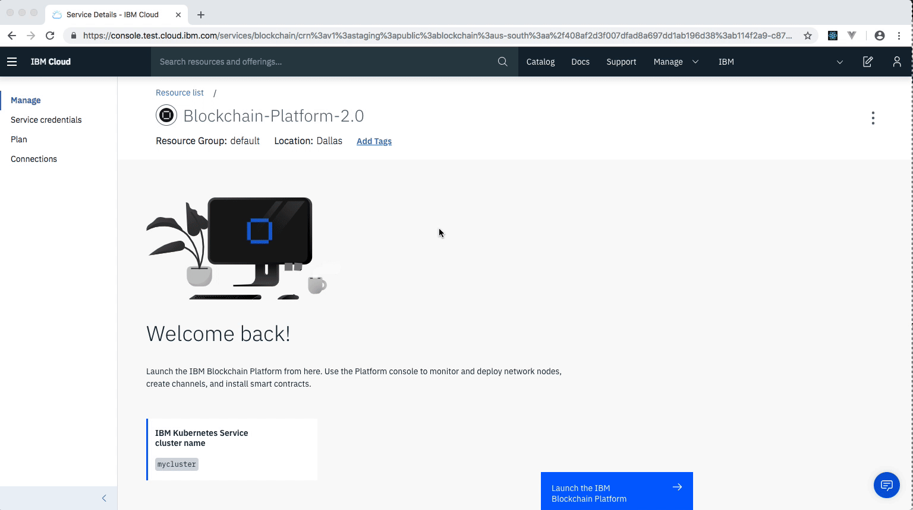
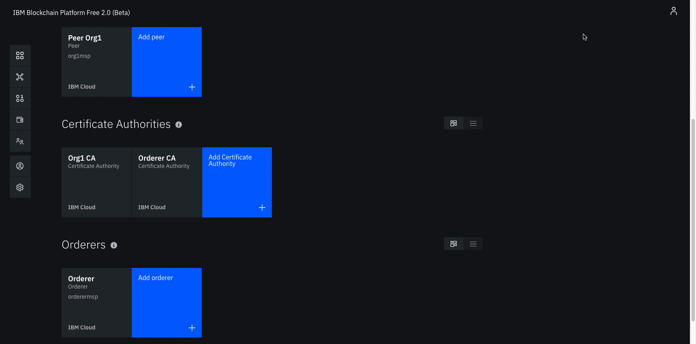
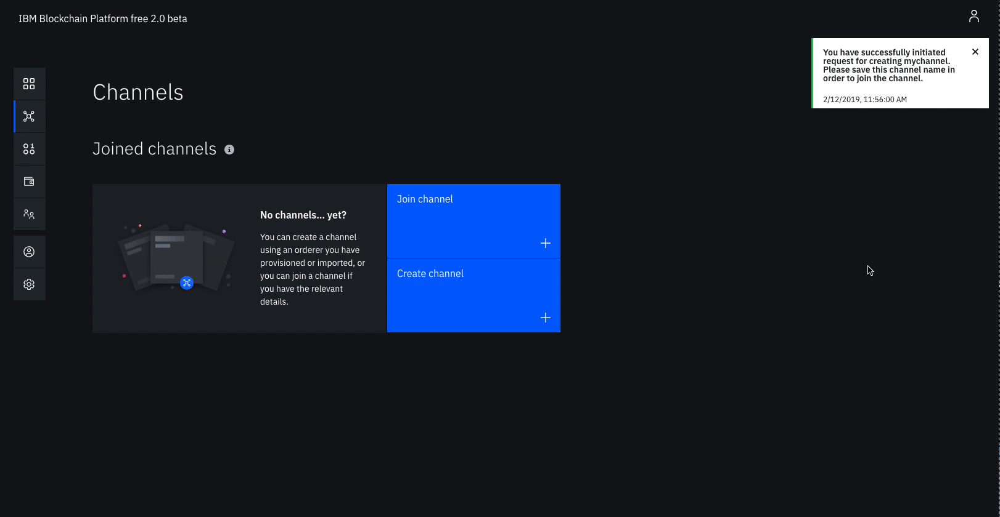
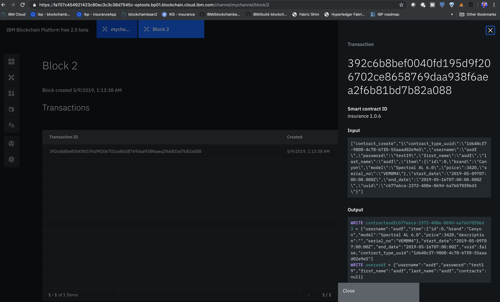

*Read this in other languages: [中国語](README-cn.md),[日本語](README-ja.md).*

# Build Blockchain Insurance Application

This project showcases the use of blockchain in insurance domain for claim processing. In this application, we have four participants, namely insurance, police, repair shop and shop peer. Insurance peer is the insurance company providing the insurance for the products and it is responsible for processing the claims. Police peer is responsible for verifying the theft claims. Repair shop peer is responsible for repairs of the product while shop peer sells the products to consumer.

*Note:* This code pattern can either be run locally, or connected to the IBM Blockchain Platform. <b>If you only care 
about running this pattern locally, please find the local instructions here.</b>

Audience level : Intermediate Developers

## Included Components
*	[IBM Blockchain Platform V2 Beta](https://console.bluemix.net/docs/services/blockchain/howto/ibp-v2-deploy-iks.html#ibp-v2-deploy-iks) gives you total control of your blockchain network with a user interface that can simplify and accelerate your journey to deploy and manage blockchain components on the IBM Cloud Kubernetes Service.
*	[IBM Cloud Kubernetes Service](https://www.ibm.com/cloud/container-service) creates a cluster of compute hosts and deploys highly available containers. A Kubernetes cluster lets you securely manage the resources that you need to quickly deploy, update, and scale applications.
* [Docker](https://www.docker.com/) Docker is a computer program that performs operating-system-level virtualization. It was first released in 2013 and is developed by Docker, Inc.

## Application Workflow Diagram


* Create Kubernetes Service
* Launch IBP2.0
* Create Peer, Certificate Authority, Orderer Nodes
* Create channel, install and instantiate chaincode
* Submit transactions through the web-app

## Prerequisites
We find that Blockchain can be finicky when it comes to installing Node. We want to share this [StackOverflow response](https://stackoverflow.com/questions/49744276/error-cannot-find-module-api-hyperledger-composer) - because many times the errors you see with Compose are derived in having installed either the wrong Node version or took an approach that is not supported by Compose:

* [Docker](https://www.docker.com/products) - latest
* [Docker Compose](https://docs.docker.com/compose/overview/) - latest
* [NPM](https://www.npmjs.com/get-npm) - latest
* [nvm]() - latest
* [Node.js](https://nodejs.org/en/download/) - latest
* [Git client](https://git-scm.com/downloads) - latest
* **[Python](https://www.python.org/downloads/) - 2.7.x**

# Steps

**Important Note:** This pattern is more advanced because it uses four organizations. For this reason, you will likely
have to get a paid kubernetes cluster to run this pattern on the cloud, since a free cluster will not have the CPU/storage 
necessary to deploy all of the pods that we need to run this pattern. There are other patterns that leverage a free
Kubernetes cluster (and only two organizations), so if you want to that one out first, go [here](https://github.com/IBM/blockchainbean2). 

## Step 1. Create IBM Cloud services

* Create the [IBM Cloud Kubernetes Service](https://cloud.ibm.com/catalog/infrastructure/containers-kubernetes).  You can 
find the service in the `Catalog`.  For this code pattern, we can use the 16CPU, 16GB RAMcluster, and give it a name. 
<b>The cluster takes around 10-15 minutes to provision, so please be patient!</b>

<br>
<p align="center">
  
</p>
<br>

* Create the [IBM Blockchain Platform V2 Beta](https://console.bluemix.net/catalog/services/blockchain/) service on the IBM Cloud.  You can find the service in the `Catalog`, and give a name.

<br>
<p align="center">
  
</p>
<br>

* After your kubernetes cluster is up and running, you can deploy your IBM Blockchain Platform V2 Beta on the cluster.  The service walks through few steps and finds your cluster on the IBM Cloud to deploy the service on.

<br>
<p align="center">
  
</p>
<br>

* Once the Blockchain Platform is deployed on the Kubernetes cluster, you can launch the console to start operating on your blockchain network.

<br>
<p align="center">
  
</p>
<br>

## Step 2. Build a network - Certificate Authority

We will build a network as provided by the IBM Blockchain Platform [documentation](https://console.bluemix.net/docs/services/blockchain/howto/ibp-console-build-network.html#ibp-console-build-network).  This will include creating a channel with a single peer organization with its own MSP and CA (Certificate Authority), and an orderer organization with its own MSP and CA. We will create the respective identities to deploy peers and operate nodes.

* #### Create your insurance organization CA 
  - Click <b>Add Certificate Authority</b>.
  - Click <b>IBM Cloud</b> under <b>Create Certificate Authority</b> and <b>Next</b>.
  - Give it a <b>Display name</b> of `Insurance CA`.  
  - Specify an <b>Admin ID</b> of `admin` and <b>Admin Secret</b> of `adminpw`.

<br>
<p align="center">
  
</p>
<br>

* #### Create your shop organization CA (process is same as shown in gif above)
  - Click <b>Add Certificate Authority</b>.
  - Click <b>IBM Cloud</b> under <b>Create Certificate Authority</b> and <b>Next</b>.
  - Give it a <b>Display name</b> of `Shop CA`.  
  - Specify an <b>Admin ID</b> of `admin` and <b>Admin Secret</b> of `adminpw`.

* #### Create your repair shop organization CA (process is same as shown in gif above)
  - Click <b>Add Certificate Authority</b>.
  - Click <b>IBM Cloud</b> under <b>Create Certificate Authority</b> and <b>Next</b>.
  - Give it a <b>Display name</b> of `Repair Shop CA`.  
  - Specify an <b>Admin ID</b> of `admin` and <b>Admin Secret</b> of `adminpw`.

* #### Create your police organization CA (process is same as shown in gif above)
  - Click <b>Add Certificate Authority</b>.
  - Click <b>IBM Cloud</b> under <b>Create Certificate Authority</b> and <b>Next</b>.
  - Give it a <b>Display name</b> of `Police CA`.  
  - Specify an <b>Admin ID</b> of `admin` and <b>Admin Secret</b> of `adminpw`.


* #### Use your CA to register insurance identities
  - Select the <b>Insurance CA</b> Certificate Authority that we created.
  - First, we will register an admin for our Insurance Organization. Click on the <b>Register User</b> button.  Give an <b>Enroll ID</b> of `insuranceAdmin`, and <b>Enroll Secret</b> of `insuranceAdminpw`.  Click <b>Next</b>.  Set the <b>Type</b> for this identity as `client` and select `org1` from the affiliated organizations drop-down list. We will leave the <b>Maximum enrollments</b> and <b>Add Attributes</b> fields blank.
  - We will repeat the process to create an identity of the peer. Click on the <b>Register User</b> button.  Give an <b>Enroll ID</b> of `insurancePeer`, and <b>Enroll Secret</b> of `insurancePeerpw`.  Click <b>Next</b>.  Set the <b>Type</b> for this identity as `peer` and select `org1` from the affiliated organizations drop-down list. We will leave the <b>Maximum enrollments</b> and <b>Add Attributes</b> fields blank.

<br>
<p align="center">
  
</p>
<br>

* #### Use your CA to register shop identities (process is same as shown in gif above)
  - Select the <b>Shop CA</b> Certificate Authority that we created.
  - First, we will register an admin for our Insurance Organization. Click on the <b>Register User</b> button.  Give an <b>Enroll ID</b> of `shopAdmin`, and <b>Enroll Secret</b> of `shopAdminpw`.  Click <b>Next</b>.  Set the <b>Type</b> for this identity as `client` and select `org1` from the affiliated organizations drop-down list. We will leave the <b>Maximum enrollments</b> and <b>Add Attributes</b> fields blank.
  - We will repeat the process to create an identity of the peer. Click on the <b>Register User</b> button.  Give an <b>Enroll ID</b> of `shopPeer`, and <b>Enroll Secret</b> of `shopPeerpw`.  Click <b>Next</b>.  Set the <b>Type</b> for this identity as `peer` and select `org1` from the affiliated organizations drop-down list. We will leave the <b>Maximum enrollments</b> and <b>Add Attributes</b> fields blank.

* #### Use your CA to register repair shop identities (process is same as shown in gif above)
  - Select the <b>Repair Shop CA</b> Certificate Authority that we created.
  - First, we will register an admin for our Insurance Organization. Click on the <b>Register User</b> button.  Give an <b>Enroll ID</b> of `repairShopAdmin`, and <b>Enroll Secret</b> of `repairShopAdminpw`.  Click <b>Next</b>.  Set the <b>Type</b> for this identity as `client` and select `org1` from the affiliated organizations drop-down list. We will leave the <b>Maximum enrollments</b> and <b>Add Attributes</b> fields blank.
  - We will repeat the process to create an identity of the peer. Click on the <b>Register User</b> button.  Give an <b>Enroll ID</b> of `repairShopPeer`, and <b>Enroll Secret</b> of `repairShopPeerpw`.  Click <b>Next</b>.  Set the <b>Type</b> for this identity as `peer` and select `org1` from the affiliated organizations drop-down list. We will leave the <b>Maximum enrollments</b> and <b>Add Attributes</b> fields blank.

* #### Use your CA to register police shop identities (process is same as shown in gif above)
  - Select the <b>Police CA</b> Certificate Authority that we created.
  - First, we will register an admin for our Insurance Organization. Click on the <b>Register User</b> button.  Give an <b>Enroll ID</b> of `policeAdmin`, and <b>Enroll Secret</b> of `policeAdminpw`.  Click <b>Next</b>.  Set the <b>Type</b> for this identity as `client` and select `org1` from the affiliated organizations drop-down list. We will leave the <b>Maximum enrollments</b> and <b>Add Attributes</b> fields blank.
  - We will repeat the process to create an identity of the peer. Click on the <b>Register User</b> button.  Give an <b>Enroll ID</b> of `policePeer`, and <b>Enroll Secret</b> of `policePeerpw`.  Click <b>Next</b>.  Set the <b>Type</b> for this identity as `peer` and select `org1` from the affiliated organizations drop-down list. We will leave the <b>Maximum enrollments</b> and <b>Add Attributes</b> fields blank.


## Step 3. Build a network - Create MSP Definitions

* #### Create the insurance MSP definition
  - Navigate to the <b>Organizations</b> tab in the left navigation and click <b>Create MSP definition</b>.
  - Enter the <b>MSP Display name</b> as `Insurance MSP` and an <b>MSP ID</b> of `insurancemsp`.
  - Under <b>Root Certificate Authority</b> details, specify the peer CA that we created `Insurance CA` as the root CA for the organization.
  - Give the <b>Enroll ID</b> and <b>Enroll secret</b> for your organization admin, `insuranceAdmin` and `insuranceAdminpw`. Then, give the Identity name, `Insurance Admin`.
  - Click the <b>Generate</b> button to enroll this identity as the admin of your organization and export the identity to the wallet. Click <b>Export</b> to export the admin certificates to your file system. Finally click <b>Create MSP definition</b>.

<br>
<p align="center">
  
</p>
<br>

* #### Create the shop MSP definition (same process as shown in gif above)
  - Navigate to the <b>Organizations</b> tab in the left navigation and click <b>Create MSP definition</b>.
  - Enter the <b>MSP Display name</b> as `Shop MSP` and an <b>MSP ID</b> of `shopmsp`.
  - Under <b>Root Certificate Authority</b> details, specify the peer CA that we created `Shop CA` as the root CA for the organization.
  - Give the <b>Enroll ID</b> and <b>Enroll secret</b> for your organization admin, `shopAdmin` and `shopAdminpw`. Then, give the Identity name, `Shop Admin`.
  - Click the <b>Generate</b> button to enroll this identity as the admin of your organization and export the identity to the wallet. Click <b>Export</b> to export the admin certificates to your file system. Finally click <b>Create MSP definition</b>.

* #### Create the repair shop MSP definition (same process as shown in gif above)
  - Navigate to the <b>Organizations</b> tab in the left navigation and click <b>Create MSP definition</b>.
  - Enter the <b>MSP Display name</b> as `Repair Shop MSP` and an <b>MSP ID</b> of `repairshopmsp`.
  - Under <b>Root Certificate Authority</b> details, specify the peer CA that we created `Shop CA` as the root CA for the organization.
  - Give the <b>Enroll ID</b> and <b>Enroll secret</b> for your organization admin, `repairShopAdmin` and `repairShopAdminpw`. Then, give the Identity name, `Repair Shop Admin`.
  - Click the <b>Generate</b> button to enroll this identity as the admin of your organization and export the identity to the wallet. Click <b>Export</b> to export the admin certificates to your file system. Finally click <b>Create MSP definition</b>.

* #### Create the police MSP definition (same process as shown in gif above)
  - Navigate to the <b>Organizations</b> tab in the left navigation and click <b>Create MSP definition</b>.
  - Enter the <b>MSP Display name</b> as `Police MSP` and an <b>MSP ID</b> of `policemsp`.
  - Under <b>Root Certificate Authority</b> details, specify the peer CA that we created `Shop CA` as the root CA for the organization.
  - Give the <b>Enroll ID</b> and <b>Enroll secret</b> for your organization admin, `policeAdmin` and `policeAdminpw`. Then, give the Identity name, `Police Admin`.
  - Click the <b>Generate</b> button to enroll this identity as the admin of your organization and export the identity to the wallet. Click <b>Export</b> to export the admin certificates to your file system. Finally click <b>Create MSP definition</b>.


## Step 4. Build a network - Create Peers

* Create an insurance peer
  - On the <b>Nodes</b> page, click <b>Add peer</b>.
  - Click <b>IBM Cloud</b> under Create a new peer and <b>Next</b>.
  - Give your peer a <b>Display name</b> of `Insurance Peer`.
  - On the next screen, select `Insurance CA` as your <b>Certificate Authority</b>. Then, give the <b>Enroll ID</b> and <b>Enroll secret</b> for the peer identity that you created for your peer, `insurancePeer`, and `insurancePeerpw`. Then, select the <b>Administrator Certificate (from MSP)</b>, `Insurance MSP`, from the drop-down list and click <b>Next</b>.
  - Give the <b>TLS Enroll ID</b>, `admin`, and <b>TLS Enroll secret</b>, `adminpw`, the same values are the Enroll ID and Enroll secret that you gave when creating the CA.  Leave the <b>TLS CSR hostname</b> blank.
  - The last side panel will ask you to <b>Associate an identity</b> and make it the admin of your peer. Select your peer admin identity `Insurance Admin`.
  - Review the summary and click <b>Submit</b>.

<br>
<p align="center">
  
</p>
<br>
 
* Create a shop peer (same process as shown in gif above)
  - On the <b>Nodes</b> page, click <b>Add peer</b>.
  - Click <b>IBM Cloud</b> under Create a new peer and <b>Next</b>.
  - Give your peer a <b>Display name</b> of `Shop Peer`.
  - On the next screen, select `Shop CA` as your <b>Certificate Authority</b>. Then, give the <b>Enroll ID</b> and <b>Enroll secret</b> for the peer identity that you created for your peer, `shopPeer`, and `shopPeerpw`. Then, select the <b>Administrator Certificate (from MSP)</b>, `Shop MSP`, from the drop-down list and click <b>Next</b>.
  - Give the <b>TLS Enroll ID</b>, `admin`, and <b>TLS Enroll secret</b>, `adminpw`, the same values are the Enroll ID and Enroll secret that you gave when creating the CA.  Leave the <b>TLS CSR hostname</b> blank.
  - The last side panel will ask you to <b>Associate an identity</b> and make it the admin of your peer. Select your peer admin identity `Shop Admin`.
  - Review the summary and click <b>Submit</b>.

* Create a repair shop peer (same process as shown in gif above)
  - On the <b>Nodes</b> page, click <b>Add peer</b>.
  - Click <b>IBM Cloud</b> under Create a new peer and <b>Next</b>.
  - Give your peer a <b>Display name</b> of `Repair Shop Peer`.
  - On the next screen, select `Repair Shop CA` as your <b>Certificate Authority</b>. Then, give the <b>Enroll ID</b> and <b>Enroll secret</b> for the peer identity that you created for your peer, `repairShopPeer`, and `repairShopPeerpw`. Then, select the <b>Administrator Certificate (from MSP)</b>, `Shop MSP`, from the drop-down list and click <b>Next</b>.
  - Give the <b>TLS Enroll ID</b>, `admin`, and <b>TLS Enroll secret</b>, `adminpw`, the same values are the Enroll ID and Enroll secret that you gave when creating the CA.  Leave the <b>TLS CSR hostname</b> blank.
  - The last side panel will ask you to <b>Associate an identity</b> and make it the admin of your peer. Select your peer admin identity `Repair Shop Admin`.
  - Review the summary and click <b>Submit</b>.

* Create a police peer (same process as shown in gif above)
  - On the <b>Nodes</b> page, click <b>Add peer</b>.
  - Click <b>IBM Cloud</b> under Create a new peer and <b>Next</b>.
  - Give your peer a <b>Display name</b> of `Police Peer`.
  - On the next screen, select `Police CA` as your <b>Certificate Authority</b>. Then, give the <b>Enroll ID</b> and <b>Enroll secret</b> for the peer identity that you created for your peer, `policePeer`, and `policePeerpw`. Then, select the <b>Administrator Certificate (from MSP)</b>, `Shop MSP`, from the drop-down list and click <b>Next</b>.
  - Give the <b>TLS Enroll ID</b>, `admin`, and <b>TLS Enroll secret</b>, `adminpw`, the same values are the Enroll ID and Enroll secret that you gave when creating the CA.  Leave the <b>TLS CSR hostname</b> blank.
  - The last side panel will ask you to <b>Associate an identity</b> and make it the admin of your peer. Select your peer admin identity `Police Admin`.
  - Review the summary and click <b>Submit</b>.

## Step 5. Build a network - Create Orderer

* #### Create your orderer organization CA
  - Click <b>Add Certificate Authority</b>.
  - Click <b>IBM Cloud</b> under <b>Create Certificate Authority</b> and <b>Next</b>.
  - Give it a unique <b>Display name</b> of `Orderer CA`.  
  - Specify an <b>Admin ID</b> of `admin` and <b>Admin Secret</b> of `adminpw`.

<br>
<p align="center">
  
</p>
<br>

* #### Use your CA to register orderer and orderer admin identities
  - In the <b>Nodes</b> tab, select the <b>Orderer CA</b> Certificate Authority that we created.
  - First, we will register an admin for our organization. Click on the <b>Register User</b> button.  Give an <b>Enroll ID</b> of `ordereradmin`, and <b>Enroll Secret</b> of `ordereradminpw`.  Click <b>Next</b>.  Set the <b>Type</b> for this identity as `client` and select `org1` from the affiliated organizations drop-down list. We will leave the <b>Maximum enrollments</b> and <b>Add Attributes</b> fields blank.
  - We will repeat the process to create an identity of the orderer. Click on the <b>Register User</b> button.  Give an <b>Enroll ID</b> of `orderer1`, and <b>Enroll Secret</b> of `orderer1pw`.  Click <b>Next</b>.  Set the <b>Type</b> for this identity as `peer` and select `org1` from the affiliated organizations drop-down list. We will leave the <b>Maximum enrollments</b> and <b>Add Attributes</b> fields blank.

<br>
<p align="center">
  
</p>
<br>

* #### Create the orderer organization MSP definition
  - Navigate to the <b>Organizations</b> tab in the left navigation and click <b>Create MSP definition</b>.
  - Enter the <b>MSP Display name</b> as `Orderer MSP` and an <b>MSP ID</b> of `orderermsp`.
  - Under <b>Root Certificate Authority</b> details, specify the peer CA that we created `Orderer CA` as the root CA for the organization.
  - Give the <b>Enroll ID</b> and <b>Enroll secret</b> for your organization admin, `ordereradmin` and `ordereradminpw`. Then, give the <b>Identity name</b>, `Orderer Admin`.
  - Click the <b>Generate</b> button to enroll this identity as the admin of your organization and export the identity to the wallet. Click <b>Export</b> to export the admin certificates to your file system. Finally click <b>Create MSP definition</b>.

<br>
<p align="center">
  
</p>
<br>

* #### Create an orderer
  - On the <b>Nodes</b> page, click <b>Add orderer</b>.
  - Click <b>IBM Cloud</b> and proceed with <b>Next</b>.
  - Give your peer a <b>Display name</b> of `Orderer`.
  - On the next screen, select `Orderer CA` as your <b>Certificate Authority</b>. Then, give the <b>Enroll ID</b> and <b>Enroll secret</b> for the peer identity that you created for your orderer, `orderer1`, and `orderer1pw`. Then, select the <b>Administrator Certificate (from MSP)</b>, `Orderer MSP`, from the drop-down list and click <b>Next</b>.
  - Give the <b>TLS Enroll ID</b>, `admin`, and <b>TLS Enroll secret</b>, `adminpw`, the same values are the Enroll ID and Enroll secret that you gave when creating the CA.  Leave the <b>TLS CSR hostname</b> blank.
  - The last side panel will ask to <b>Associate an identity</b> and make it the admin of your peer. Select your peer admin identity `Orderer Admin`.
  - Review the summary and click <b>Submit</b>.

<br>
<p align="center">
  
</p>
<br>

* #### Add organizations as Consortium Member on the orderer to transact
  - Navigate to the <b>Nodes</b> tab, and click on the <b>Orderer</b> that we created.
  - Under <b>Consortium Members</b>, click <b>Add organization</b>.
  - From the drop-down list, select `Insurance MSP`.
  - Click <b>Submit</b>.
  - Repeat the same steps, but add `Shop MSP`, `Repair Shop MSP`, and `Police MSP` as well.

<br>
<p align="center">
  
</p>
<br>

## Step 6. Build a network - Create and Join Channel

* #### Create the channel
  - Navigate to the <b>Channels</b> tab in the left navigation.
  - Click <b>Create channel</b>.
  - Give the channel a name, `mychannel`.
  - Select the orderer you created, `Orderer` from the orderers drop-down list.
  - Select the MSP identifying the organization of the channel creator from the drop-down list. This should be `Insurance MSP (insurancemsp)`.
  - Associate available identity as `Insurance Admin`.
  - Click <b>Add</b> next to the insurance organization. Make the insurance organization an <b>Operator</b>.
  - Click <b>Add</b> next to the shop organization. Make the shop organization an <b>Operator</b>.
  - Click <b>Add</b> next to the repair shop organization. Make the repair shop organization an <b>Operator</b>.
  - Click <b>Add</b> next to the police organization. Make the insurance organpoliceization an <b>Operator</b>.
  - Click <b>Create</b>.

<br>
<p align="center">
  
</p>
<br>


* #### Join your peer to the channel
  - Click <b>Join channel</b> to launch the side panels.
  - Select your `Orderer` and click <b>Next</b>.
  - Enter the name of the channel you just created. `mychannel` and click <b>Next</b>.
  - Select which peers you want to join the channel, click `Insurance Peer`, `Shop Peer`, `Repair Shop Peer`, and `Police Peer`.
  - Click <b>Submit</b>.

<br>
<p align="center">
  
</p>
<br>

## Step 7. Deploy Insurance Smart Contract on the network

* #### Install a smart contract
* Clone the repository:
  ```bash
  git clone https://github.com/IBM/build-blockchain-insurance-app
  ```
  - Click the <b>Smart contracts</b> tab to install the smart contract.
  - Click <b>Install smart contract</b> to upload the insurance smart contract package file.
  - Click on <b>Add file</b> and find your packaged smart contract. It is the file in the `build-blockchain-insurance-app/chaincodePackage` directory. 
  - Once the contract is uploaded, click <b>Install</b>.


<br>
<p align="center">
  
</p>
<br>

* #### Instantiate smart contract
  - On the smart contracts tab, find the smart contract from the list installed on your peers and click <b>Instantiate</b> from the overflow menu on the right side of the row.
  - On the side panel that opens, select the channel, `mychannel` to instantiate the smart contract on. Click <b>Next</b>.
  - Select the organization members to be included in the policy, `insurancemsp`, `shopmsp`, `repairshopmsp`, `policemsp`.  Click <b>Next</b>.
  - Give <b>Function name</b> of `Init` and leave <b>Arguments</b> blank.
  - Click <b>Instantiate</b>.

<br>
<p align="center">
  
</p>
<br>

## Step 8. Connect application to the network

* #### Connect with sdk through connection profile
  - Under the Instantiated Smart Contract, click on `Connect with SDK` from the overflow menu on the right side of the row.
  - Choose from the dropdown for <b>MSP for connection</b>, `insurancemsp`.
  - Choose from <b>Certificate Authority</b> dropdown, `Insurance CA`.
  - Download the connection profile by scrolling down and clicking <b>Download Connection Profile</b>.  This will download the connection json which we will use soon to establish connection.
  - You can click <b>Close</b> once the download completes.

<br>
<p align="center">
  
</p>
<br>

* #### Create insurance application admin
  - Go to the <b>Nodes</b> tab on the left bar, and under <b>Certificate Authorities</b>, choose your <b>Insurance CA</b>.
  - Click on <b>Register user</b>.
  - Give an <b>Enroll ID</b> and <b>Enroll Secret</b> to administer your application users, `insuranceApp-admin` and `insuranceApp-adminpw`.
  - Choose `client` as <b>Type</b> and any organization for affiliation.  We can pick `org1` to be consistent.
  - You can leave the <b>Maximum enrollments</b> blank.
  - Under <b>Attributes</b>, click on <b>Add attribute</b>.  Give attribute as `hf.Registrar.Roles` = `*`.  This will allow this identity to act as registrar and issues identities for our app.  Click <b>Add-attribute</b>.
  - Click <b>Register</b>.

<br>
<p align="center">
  
</p>
<br>

* #### Create shop application admin (same process as shown above in the gif)
  - Go to the <b>Nodes</b> tab on the left bar, and under <b>Certificate Authorities</b>, choose your <b>Shop CA</b>.
  - Click on <b>Register user</b>.
  - Give an <b>Enroll ID</b> and <b>Enroll Secret</b> to administer your application users, `shopApp-admin` and `shopApp-adminpw`.
  - Choose `client` as <b>Type</b> and any organization for affiliation.  We can pick `org1` to be consistent.
  - You can leave the <b>Maximum enrollments</b> blank.
  - Under <b>Attributes</b>, click on <b>Add attribute</b>.  Give attribute as `hf.Registrar.Roles` = `*`.  This will allow this identity to act as registrar and issues identities for our app.  Click <b>Add-attribute</b>.
  - Click <b>Register</b>.

* #### Create repair shop application admin (same process as shown above in the gif)
  - Go to the <b>Nodes</b> tab on the left bar, and under <b>Certificate Authorities</b>, choose your <b>Shop CA</b>.
  - Click on <b>Register user</b>.
  - Give an <b>Enroll ID</b> and <b>Enroll Secret</b> to administer your application users, `repairShopApp-admin` and `repairShopApp-adminpw`.
  - Choose `client` as <b>Type</b> and any organization for affiliation.  We can pick `org1` to be consistent.
  - You can leave the <b>Maximum enrollments</b> blank.
  - Under <b>Attributes</b>, click on <b>Add attribute</b>.  Give attribute as `hf.Registrar.Roles` = `*`.  This will allow this identity to act as registrar and issues identities for our app.  Click <b>Add-attribute</b>.
  - Click <b>Register</b>.

* #### Create police application admin (same process as shown above in the gif)
  - Go to the <b>Nodes</b> tab on the left bar, and under <b>Certificate Authorities</b>, choose your <b>Shop CA</b>.
  - Click on <b>Register user</b>.
  - Give an <b>Enroll ID</b> and <b>Enroll Secret</b> to administer your application users, `policeApp-admin` and `policeApp-adminpw`.
  - Choose `client` as <b>Type</b> and any organization for affiliation.  We can pick `org1` to be consistent.
  - You can leave the <b>Maximum enrollments</b> blank.
  - Under <b>Attributes</b>, click on <b>Add attribute</b>.  Give attribute as `hf.Registrar.Roles` = `*`.  This will allow this identity to act as registrar and issues identities for our app.  Click <b>Add-attribute</b>.
  - Click <b>Register</b>.

 #### Update application connection
  - Copy the connection profile you downloaded into the `web/www/blockchain` directory.
  - Name the connection profile you downloaded **ibpConnection.json**. This should automatically overwrite the 
    file that is currently in that directory. 
  - Your new folder structure should look like below (i.e. should have your newly downloaded and newly renamed file **ibpConnection.json**: 

  <p align="center">
    
  </p>

  - The **ibpConnection.json** file should look something like this: 

   <p align="center">
    
  </p>

  - Update the [config.json](server/config.json) file with:
    - The connection json file name you downloaded.
    - The <b>enroll id</b> and <b>enroll secret</b> for your app admin, which we earlier provided as `insuranceApp-admin` and `insuranceApp-adminpw`.
    - The orgMSP ID, which we provided as `insurancemsp`.
    - The caName, which can be found in your connection json file under "organization" -> "insurance" -> certificateAuthorities". This would be like an IP address and a port. This is circled in red above.
    - The username you would like to register.
    - Update gateway discovery to `{ enabled: true, asLocalhost: false }` to connect to IBP.

> the current default setup is to connect to a local fabric instance from VS Code

- Once you are done, the final version of the **config.json** should look something like this (note that I took the caName from the above pic):

  ```js
  {
      "connection_file": "ibpConnection.json",
      "appAdmin": "insuranceApp-admin",
      "appAdminSecret": "insuranceApp-adminpw",
      "orgMSPID": "insurancemsp",
      "caName": "fa707c454921423c80ec3c3c38d7545c-ca29327e.horeainsurancetest.us-south.containers.appdomain.cloud:7054",
      "userName": "insuranceUser",
      "gatewayDiscovery": { "enabled": true, "asLocalhost": false }
  }
  ```

## Step 9. Enroll App Admin Identities

* #### Enroll insurnaceApp-admin
  - First, navigate to the `web/www/blockchain` directory.
    ```bash
    cd web/www/blockchain/
    ```
  
  - Run the `enrollAdmin.js` script
    ```bash
    node enrollAdmin.js
    ```

  - You should see the following in the terminal:
    ```bash
    msg: Successfully enrolled admin user insuranceApp-admin and imported it into the wallet
    ```

* #### Enroll shopApp-admin
  - First, change the appAdmin, appAdminSecret, and caName properties in your `config.json` file, 
  so that it looks something like this (your caName should be different than mine):

    ```js
    {
        "connection_file": "ibpConnection.json",
        "appAdmin": "shopApp-admin",
        "appAdminSecret": "shopApp-adminpw",
        "orgMSPID": "shopmsp",
        "caName": "fa707c454921423c80e8d7545c-9327e.horeainsurancetest.us-south.containers.appdomain.cloud:7054",
        "userName": "shopUser",
        "gatewayDiscovery": { "enabled": true, "asLocalhost": false }
    }
    ```
  
  - Run the `enrollAdmin.js` script
    ```bash
    node enrollAdmin.js
    ```

  - You should see the following in the terminal:
    ```bash
    msg: Successfully enrolled admin user shopApp-admin and imported it into the wallet
    ```

* #### Enroll repairShopApp-admin
  - First, change the appAdmin, appAdminSecret, and caName properties in your `config.json` file, 
  so that it looks something like this (your caName should be different than mine):

    ```js
    {
        "connection_file": "ibpConnection.json",
        "appAdmin": "repairShopApp-admin",
        "appAdminSecret": "repairShopApp-adminpw",
        "orgMSPID": "repairshopmsp",
        "caName": "fsdfasfds-9327e.horeainsurancetest.us-south.containers.appdomain.cloud:7054",
        "userName": "repairUser",
        "gatewayDiscovery": { "enabled": true, "asLocalhost": false }
    }
    ```
  - Run the `enrollAdmin.js` script
  ```bash
  node enrollAdmin.js
  ```

  - You should see the following in the terminal:
    ```bash
    msg: Successfully enrolled admin user repairShopApp-admin and imported it into the wallet
    ```

* #### Enroll policeApp-admin
  - First, change the appAdmin, appAdminSecret, and caName properties in your `config.json` file, 
  so that it looks something like this (your caName should be different than mine):

    ```js
    {
        "connection_file": "ibpConnection.json",
        "appAdmin": "policeApp-admin",
        "appAdminSecret": "policeApp-adminpw",
        "orgMSPID": "policemsp",
        "caName": "fsdfafafsfds-9327e.horeainsurancetest.us-south.containers.appdomain.cloud:7054",
        "userName": "policeUser",
        "gatewayDiscovery": { "enabled": true, "asLocalhost": false }
    }
    ```

  - Run the `enrollAdmin.js` script
  ```bash
  node enrollAdmin.js
  ```

  - You should see the following in the terminal:
  ```bash
  msg: Successfully enrolled admin user policeApp-admin and imported it into the wallet
  ```
  
  

[Run the application](10-run-the-application)

## Step 10. Run the application

Clone the repository:
```bash
git clone https://github.com/IBM/build-blockchain-insurance-app
```

Login using your [docker hub](https://hub.docker.com/) credentials.
```bash
docker login
```

Run the build script to download and create docker images for the orderer, insurance-peer, police-peer, shop-peer, repairshop-peer, web application and certificate authorities for each peer. This will run for a few minutes.

For Mac user:
```bash
cd build-blockchain-insurance-app
./build_mac.sh
```

For Ubuntu user:
```bash
cd build-blockchain-insurance-app
./build_ubuntu.sh
```

You should see the following output on console:
```
Creating repairshop-ca ...
Creating insurance-ca ...
Creating shop-ca ...
Creating police-ca ...
Creating orderer0 ...
Creating repairshop-ca
Creating insurance-ca
Creating police-ca
Creating shop-ca
Creating orderer0 ... done
Creating insurance-peer ...
Creating insurance-peer ... done
Creating shop-peer ...
Creating shop-peer ... done
Creating repairshop-peer ...
Creating repairshop-peer ... done
Creating web ...
Creating police-peer ...
Creating web
Creating police-peer ... done
```

**Wait for few minutes for application to install and instantiate the chaincode on network**

Check the status of installation using command:
```bash
docker logs web
```
On completion, you should see the following output on console:
```
> blockchain-for-insurance@2.1.0 serve /app
> cross-env NODE_ENV=production&&node ./bin/server

/app/app/static/js
Server running on port: 3000
Default channel not found, attempting creation...
Successfully created a new default channel.
Joining peers to the default channel.
Chaincode is not installed, attempting installation...
Base container image present.
info: [packager/Golang.js]: packaging GOLANG from bcins
info: [packager/Golang.js]: packaging GOLANG from bcins
info: [packager/Golang.js]: packaging GOLANG from bcins
info: [packager/Golang.js]: packaging GOLANG from bcins
Successfully installed chaincode on the default channel.
Successfully instantiated chaincode on all peers.
```

Use the link http://localhost:3000 to load the web application in browser.

The home page shows the participants (Peers) in the network. You can see that there is an Insurance, Repair Shop, Police and Shop Peer implemented. They are the participants of the network.


Imagine being a consumer (hereinafter called “Biker”) that wants to buy a phone, bike or Ski. By clicking on the “Go to the shop” section, you will be redirected to the shop (shop peer) that offers you the following products.


You can see the three products offered by the shop(s) now. In addition, you have insurance contracts available for them. In our scenario, you are an outdoor sport enthusiast who wants to buy a new Bike. Therefore, you’ll click on the Bike Shop section.


In this section, you are viewing the different bikes available in the store. You can select within four different Bikes. By clicking on next you’ll be forwarded to the next page which will ask for the customer’s personal data.


You have the choice between different insurance contracts that feature different coverage as well as terms and conditions. You are required to type-in your personal data and select a start and end date of the contract. Since there is a trend of short-term or event-driven contracts in the insurance industry you have the chance to select the duration of the contract on a daily basis. The daily price of the insurance contract is being calculated by a formula that had been defined in the chaincode. By clicking on next you will be forwarded to a screen that summarizes your purchase and shows you the total sum.


The application will show you the total sum of your purchase. By clicking on “order” you agree to the terms and conditions and close the deal (signing of the contract). In addition, you’ll receive a unique username and password. The login credentials will be used once you file a claim.  A block is being written to the Blockchain.

>note You can see the block by clicking on the black arrow on the bottom-right.

At this point, you should be able to go into your IBM Blockchain Platform console, click on the channels, and then 
be able to see the contract_create block being added. 




## Additional resources
Following is a list of additional blockchain resources:
* [Fundamentals of IBM Blockchain](https://www.ibm.com/blockchain/what-is-blockchain)
* [Hyperledger Fabric Documentation](https://hyperledger-fabric.readthedocs.io/)
* [Hyperledger Fabric code on GitHub](https://github.com/hyperledger/fabric)

## Troubleshooting

* Run `clean.sh` to remove the docker images and containers for the insurance network.
```bash
./clean.sh
```
## License
This code pattern is licensed under the Apache Software License, Version 2.  Separate third party code objects invoked within this code pattern are licensed by their respective providers pursuant to their own separate licenses. Contributions are subject to the [Developer Certificate of Origin, Version 1.1 (DCO)](https://developercertificate.org/) and the [Apache Software License, Version 2](https://www.apache.org/licenses/LICENSE-2.0.txt).

[Apache Software License (ASL) FAQ](https://www.apache.org/foundation/license-faq.html#WhatDoesItMEAN)
