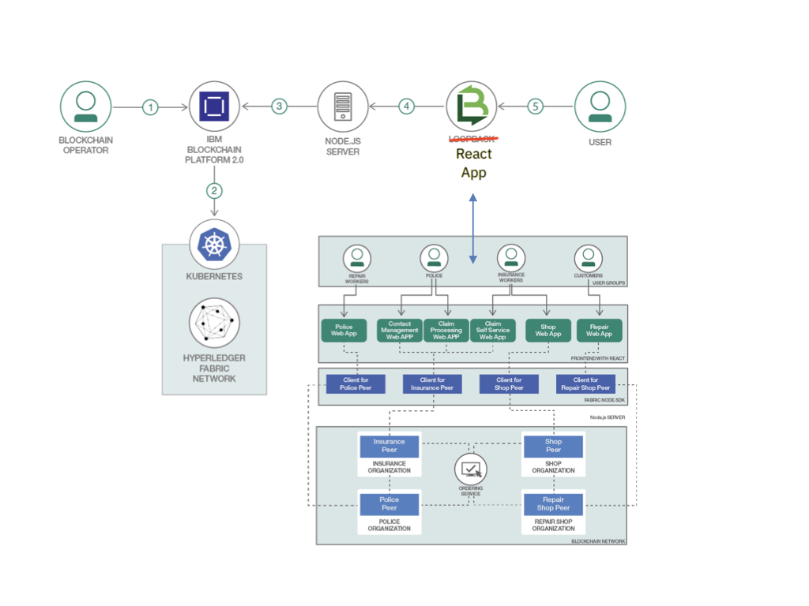

> Use this file to gather the content required for the pattern overview. Copy this draft-patten-template.md file, replace with your own content for each of the sections below, and attach your file to the GitHub tracking issue for your pattern.

> For full details on requirements for each section, see "Write a code pattern overview" on w3 Developer: [https://w3.ibm.com/developer/documentation/write-code-pattern-overview/](https://w3.ibm.com/developer/documentation/write-code-pattern-overview/)

# Short title

> Build a blockchain insurance app

# Long title

> Expand on the short title, focusing on open source or generic tools and programs. Include IBM product names only if that product is required in the pattern and cannot be substituted.

Build a web-based blockchain insurance app using IBM Blockchain Platform and IBM Kubernetes Service 

# Author

* Horea Porutiu <horea.porutiu@ibm.com>
* Ishan Gulhane <ishan.gulhane@ibm.com>

# URLs

### Github repo

> https://github.com/IBM/build-blockchain-insurance-app

### Other URLs

* Demo URL - https://www.youtube.com/watch?v=Lr3EFKayP0o

# Summary

> With its distributed ledger, smart contracts, and non-repudiation capabilities, blockchain is revolutionizing the way financial organizations do business, and the insurance industry is no exception. This code pattern shows you how to implement a web-based blockchain app using the IBM Blockchain Platform to facilitate insurance sales and claims.

# Technologies

* [Hyperledger Fabric v1.4](https://hyperledger-fabric.readthedocs.io/en/release-1.4/): A platform for distributed ledger solutions, underpinned by a modular architecture that delivers high degrees of confidentiality, resiliency, flexibility, and scalability.

[Node.js](https://nodejs.org/en/):An open source, cross-platform JavaScript run-time environment that executes server-side JavaScript code.

# Description

This pattern has been updated to support submitting transactions with the Hyperledger Fabric V1.4 programming model.

Most of us have been there: you’ve just had a fender-bender and now you’re dreading the time and effort it is going to take to deal with your insurance company, the police, and the other driver. Even if things go relatively smoothly, it is still a major disruption of your schedule.

But what if you as a developer could turn things around and actually disrupt the insurance industry? What if you could improve not only your own experience but also that of millions of people around the world dealing with the same inconveniences, delays, and administrative frustrations? Well, this is your chance.

Blockchain presents a huge opportunity for the insurance industry. It offers the chance to innovate around the way data is exchanged, claims are processed, and fraud is prevented. Blockchain can bring together developers from tech companies, regulators, and insurance companies to create a valuable new insurance management asset.

A natural pairing
Through its distributed ledger, smart contracts, and non-repudiation capabilities that act as a shared infrastructure, blockchain can transform all kinds of insurance processes. Currently, many insurance processes are manual, error prone, and can require long processing times. There are often different versions of the same data in multiple systems of record, leading to added costs and lengthy disputes.

With blockchain, manual processes are automated by sharing information on plan participants, entitlements, and claim data. Smart contracts are computationally encoded with participant registration and verification rules. Shared data and smart contract computations reduce downstream disputes. Benefits verification is based on multiple data sources that are readily available to all service providers.

Here is the bottom line: blockchain technology provides an opportunity for the insurance industry to improve their operating efficiency, lower the costs of transaction processing, enhance the customer experience, improve data quality, and increase trust between parties.

When you complete this code pattern, you will know how to build a functional blockchain insurance app. The app will have four participants, or peers:

Insurance
Police
Repair shop
Shop
The Insurance peer is the company that provides the insurance for the product (in our example, the car) and who is responsible for processing the claims. The Police peer is responsible for verifying the accident or theft claims. The Repair shop peer is responsible for repairs of the product. The Shop peer sells the products to a consumer.

How it works
So how does the app actually work? Imagine a sport enthusiast, Susie, decides she wants to purchase a new bike. She goes to the bike shop and finds an amazing deal on a road racer. As part of the purchase process, she is offered an insurance contract, which she agrees is important to have. She signs up for it, providing her personal data along with a start and end date for the contract. The daily price is calculated by a formula in the chaincode once the contract is processed. When all the paperwork is complete, Suzie is given credentials so she can log in at any time if she needs to file a claim. At this point, a block is written to the blockchain to maintain the transaction.

As luck would have it, ten days later her bike is stolen when she rides up to the Berkeley Hills. After reporting the theft to the police, she opens the self-service tab on the app, logs in, describes the theft, and files her claim with the insurance company. When she submits the claim, it is written onto the block as another transaction. The claim is first processed by the police, who can either confirm or deny the theft; in this case, the theft is confirmed, the police attach a file reference number, and another block is written to the chain. (In the same manner, if Suzie had filed a claim for a bike accident that resulted in damage to the bike, it would be a repair shop that processed the claim instead of the police.) The insurance company monitors all active claims on the blockchain, so when the police submit their verification, the company receives that confirmation and submits a reimbursement for the claim. Just as with the previous transactions, the reimbursement is written to the blockchain. Susie is happy to see that the insurance company has paid her claim, although not quite as happy as she would be if she had her bike back!

Note that insurance companies have the option to activate or deactivate certain contracts. This does not mean that contracts that have already been signed by customers will no longer be valid; it simply does not allow new signings for these types of contracts. In addition, the insurance company can create new contract templates with different terms and conditions, or a different pricing structure.

The web-based application is written in Node.js and React. The application chaincode (that is, the smart contracts) is written in the Go language.

So do not fret about possible disruptions to your routine the next time you have a bit of automotive, or cycling, bad luck. Complete this code pattern, build your blockchain skills, and help disrupt an entire industry!

# Flow

1. The blockchain operator creates a IBM Kubernetes Service cluster (<b>32CPU, 32RAM, 3 workers recommended</b>) and an IBM Blockchain 
Platform 2.0 service.
2. The IBM Blockchain Platform 2.0 creates a Hyperledger Fabric network on an IBM Kubernetes 
Service, and the operator installs and instantiates the smart contract on the network.
3. The Node.js application server uses the Fabric SDK to interact with the deployed network on IBM Blockchain Platform 2.0.
4. The React UI uses the Node.js application API to interact and submit transactions to the network.
5. The user interacts with the insurance application web interface to update and query the blockchain ledger and state.

# Instructions

> Find the detailed steps for this pattern in the [readme file](https://github.com/IBM/build-blockchain-insurance-app#steps). The steps will show you how to:

1. Create IBM Cloud services
2. Build a network - Certificate Authority
3. Build a network - Create MSP Definitions
4. Build a network - Create Peers
5. Build a network - Create Orderer
6. Build a network - Create and Join Channel
7. Deploy Insurance Smart Contract on the network
8. Connect application to the network
9. Enroll App Admin Identities
10. Run the application

# Components and services

[IBM Cloud Kubernetes Service](https://cloud.ibm.com/catalog/infrastructure/containers-kubernetes)

[Blockchain Platform 2.0](https://cloud.ibm.com/catalog/services/blockchain-platform-20)

# Runtimes

* Node.js

# Related IBM Developer content
* [Create a basic blockchain network using Blockchain Platform V2.0](https://developer.ibm.com/patterns/build-a-blockchain-network/): Package blockchain smart contracts, set up a Hyperledger Fabric network, and execute a Node.js app with the Hyperledger Fabric SDK to interact with the deployed network.
* [Create a fair trade supply chain network](https://developer.ibm.com/patterns/coffee-supply-chain-network-hyperledger-fabric-blockchain-2/): Use Hyperledger Fabric and IBM Blockchain Platform 2.0 to increase efficiency in the supply chain of a coffee retailer.

# Related links
* [Hyperledger Fabric Docs](https://hyperledger-fabric.readthedocs.io/en/release-1.4/): Enterprise grade permissioned distributed ledger platform that offers modularity and versatility for a broad set of industry use cases.

